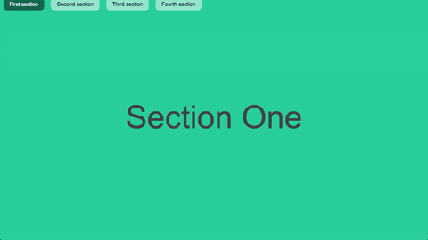

# react-with-fullpage

This is an tempolate of [fullpage.js](http://alvarotrigo.com/fullPage/) in react.

# Usage

```
1. git clone https://github.com/jobn123/react-with-fullpage.git
2. npm install
3. npm run  dev
4. then type localhost:8080 in your browser
```

# screenshots



